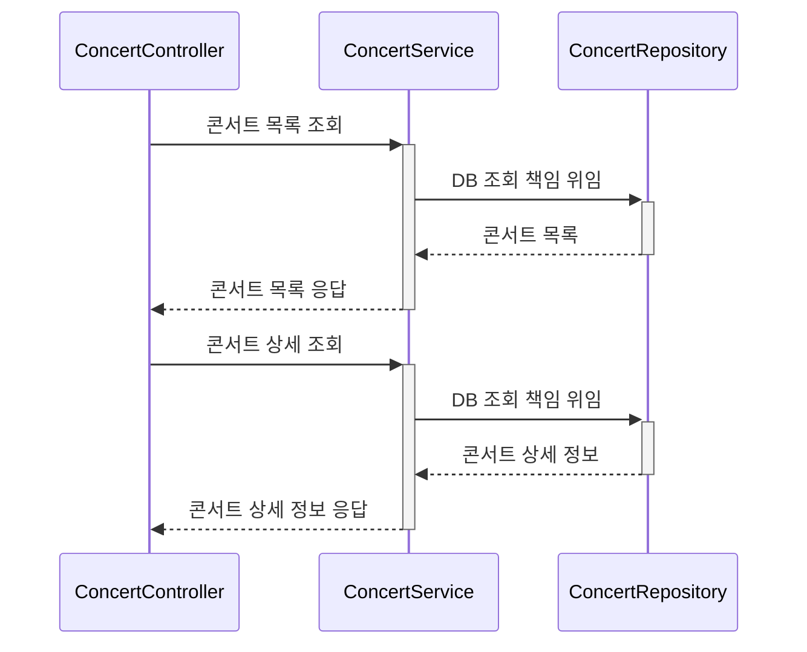
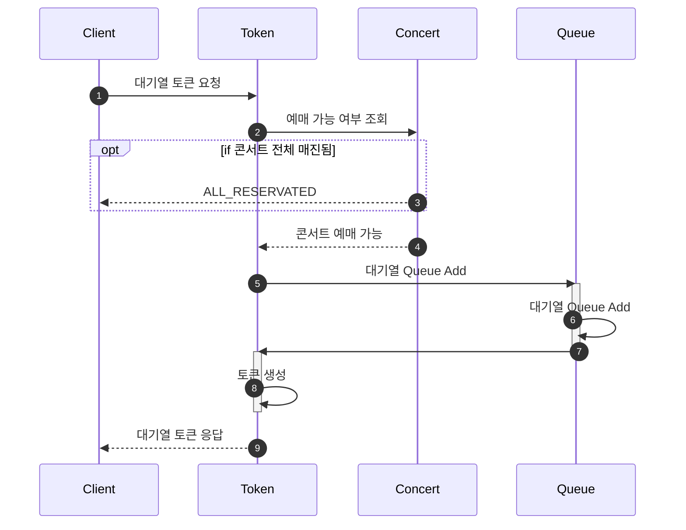
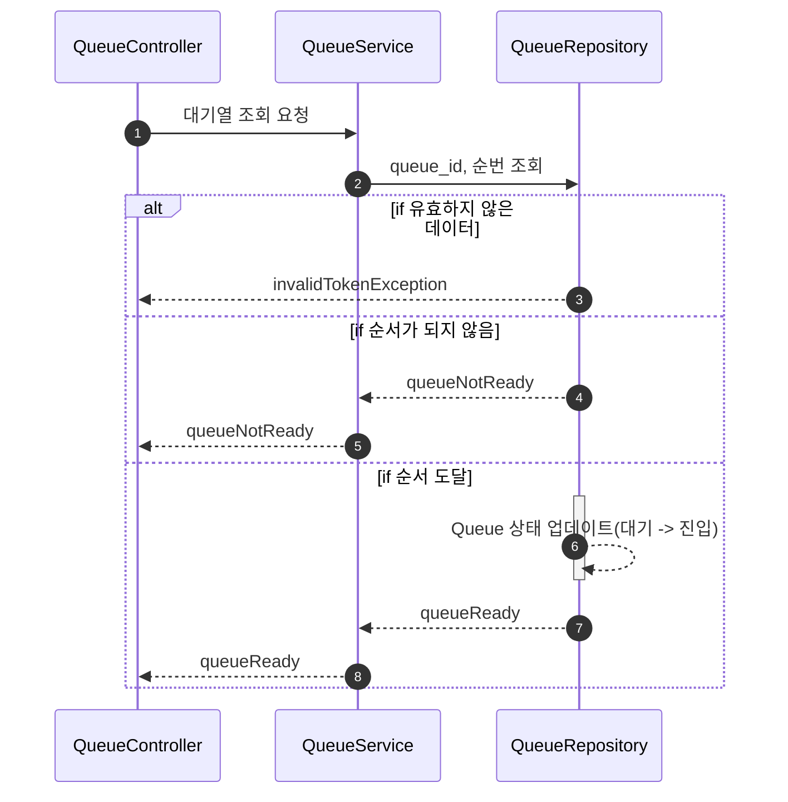
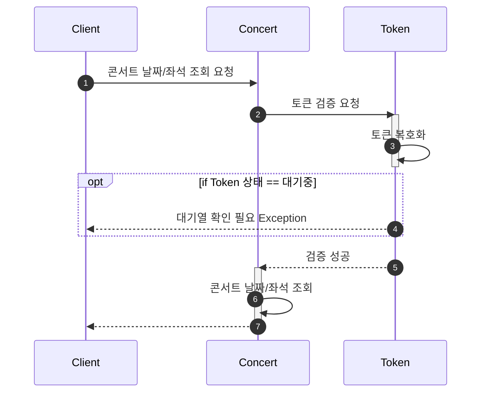
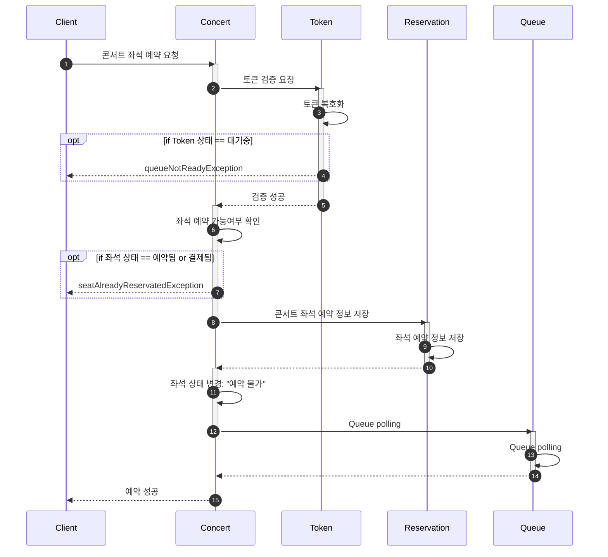
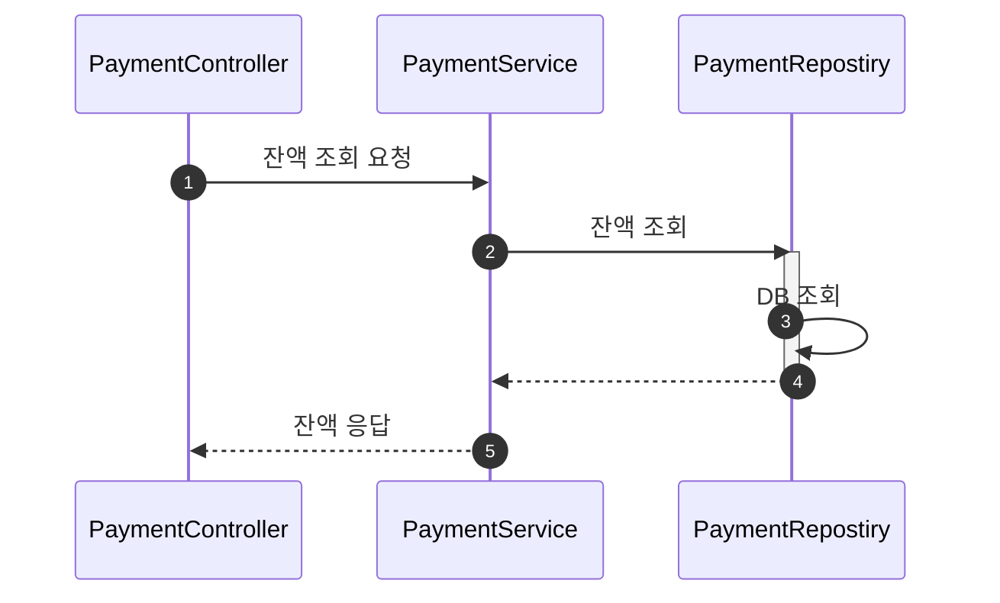
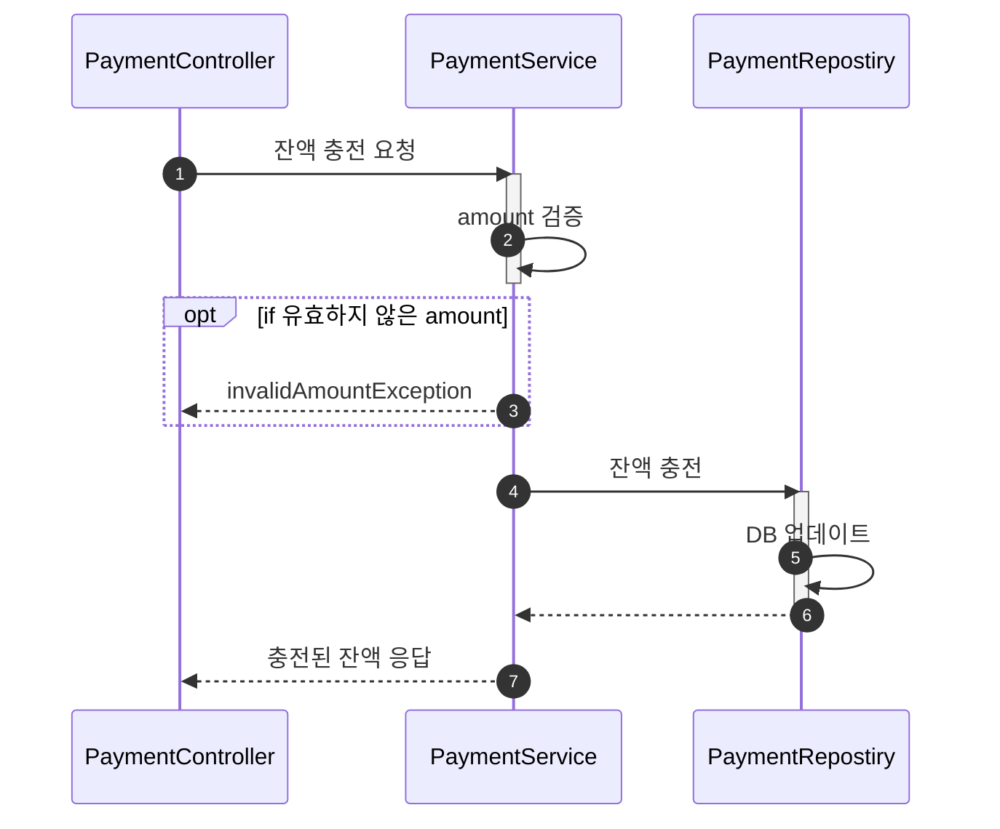
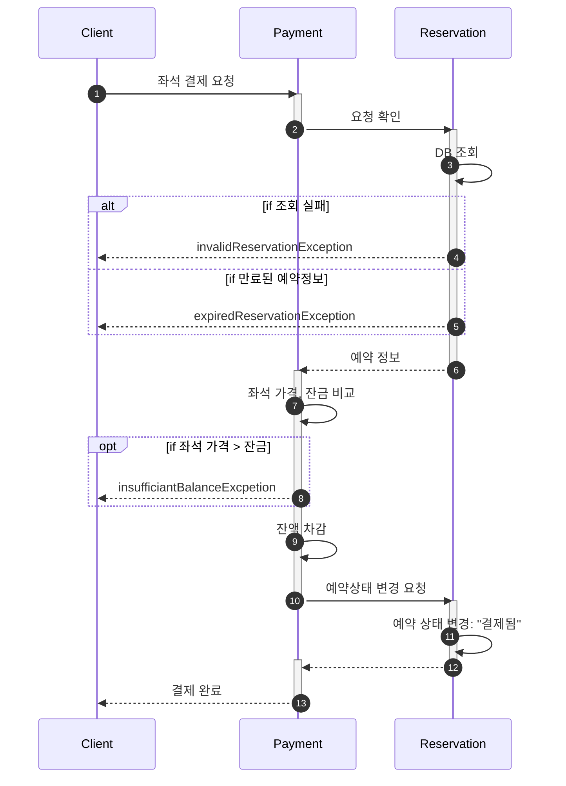
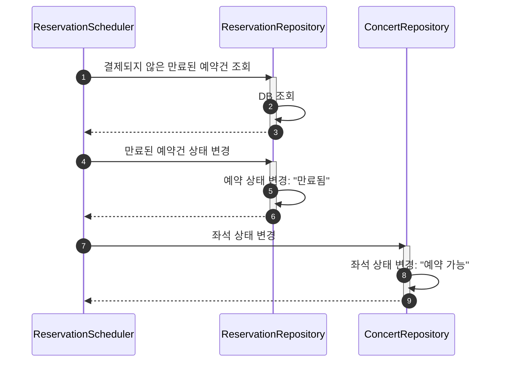

## 프로젝트
<details>

<summary>Getting Started</summary>

### Prerequisites

#### Running Docker Containers

`local` profile 로 실행하기 위하여 인프라가 설정되어 있는 Docker 컨테이너를 실행해주셔야 합니다.

```bash
docker-compose up -d
```
</details>

<details>
<summary>시퀀스 다이어그램</summary>

<details>
<summary><b>📌콘서트 조회 시퀀스 다이어그램</b></summary>
	

</details>

<details>
<summary><b>📌대기열 토큰 요청 시퀀스 다이어그램</b></summary>


</details>

<details>
<summary><b>📌대기열 확인 시퀀스 다이어그램</b></summary>


</details>

<details>
<summary><b>📌콘서트 날짜, 좌석 조회 시퀀스 다이어그램</b></summary>


</details>

<details>
<summary><b>📌콘서트 좌석 예약 시퀀스 다이어그램</b></summary>


</details>

<details>
<summary><b>📌잔액 조회 시퀀스 다이어그램</b></summary>


</details>

<details>
<summary><b>📌잔액 충전 시퀀스 다이어그램</b></summary>


</details>

<details>
<summary><b>📌좌석 결제 시퀀스 다이어그램</b></summary>


</details>

<details>
<summary><b>📌예약상태 스케줄러 시퀀스 다이어그램</b></summary>


</details>
</details>
<details>
<summary><b>ERD</b></summary>
	


</details>
