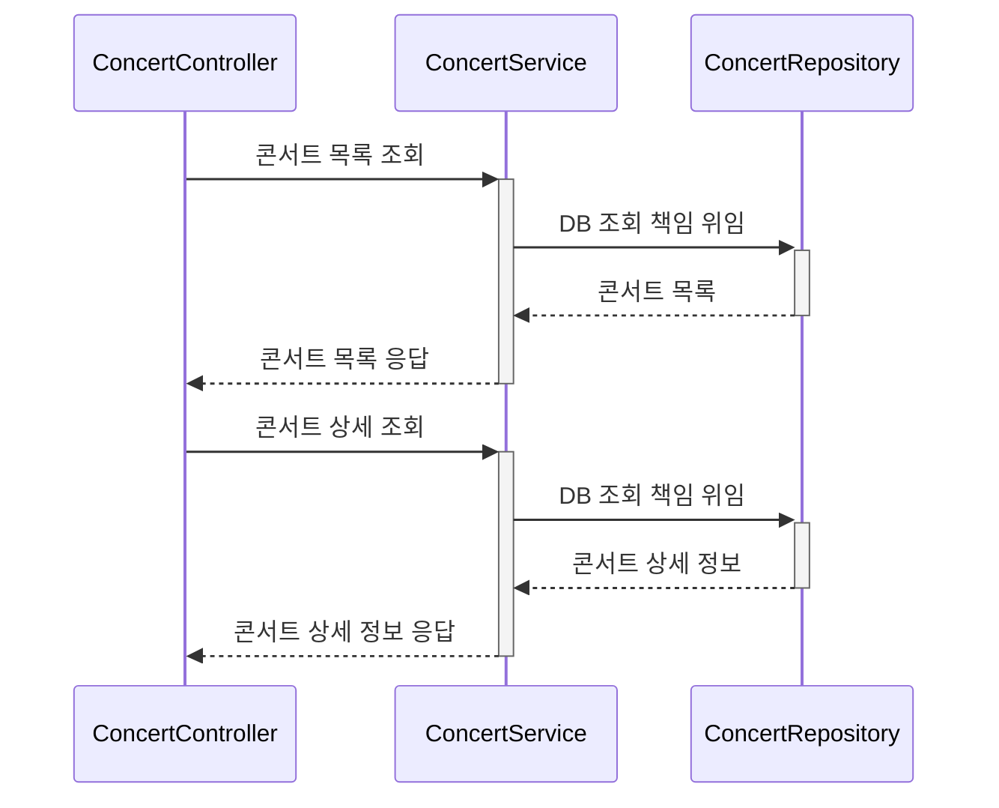
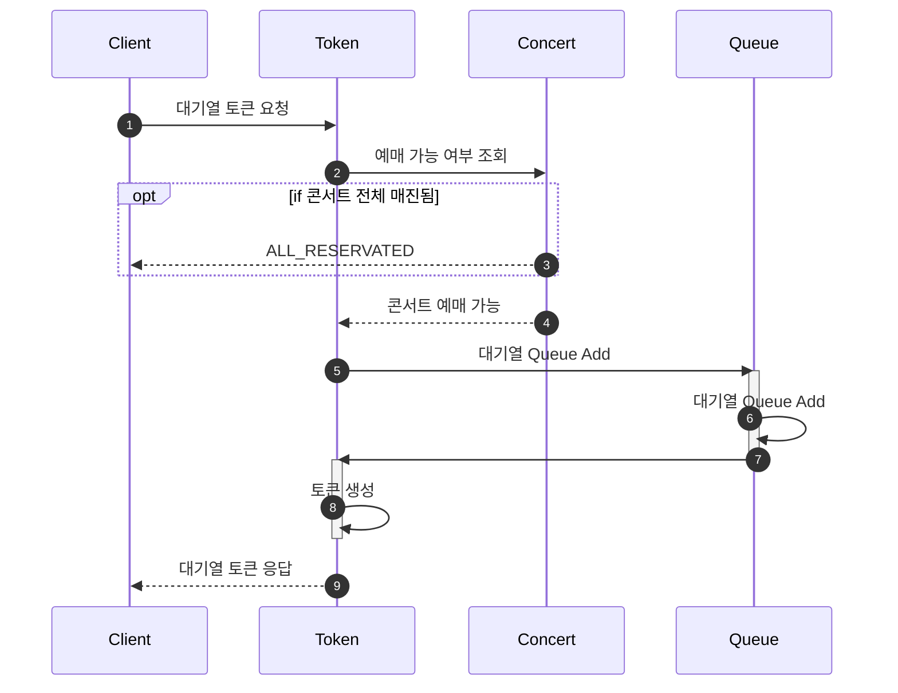
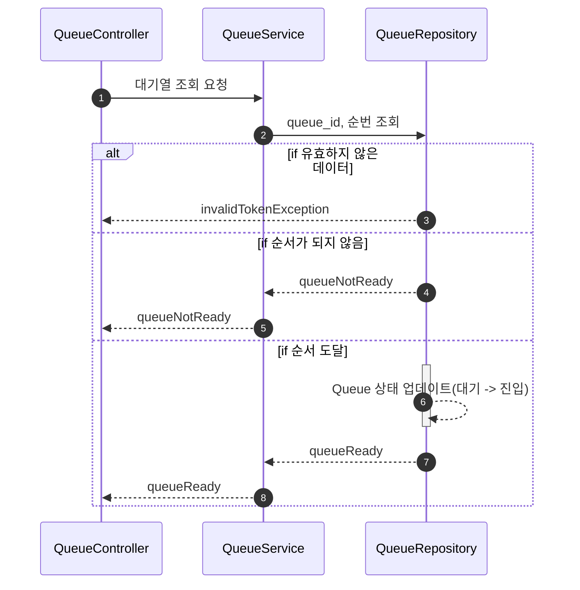
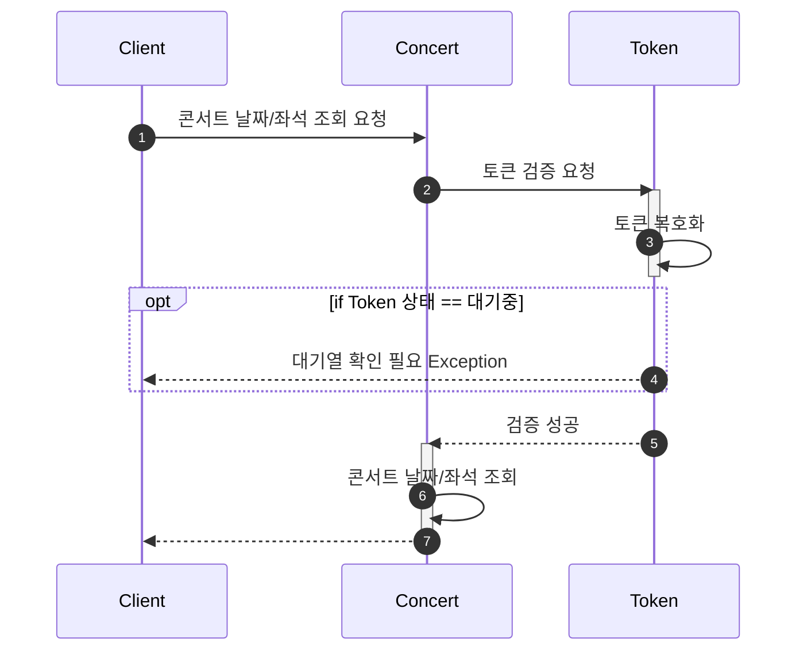
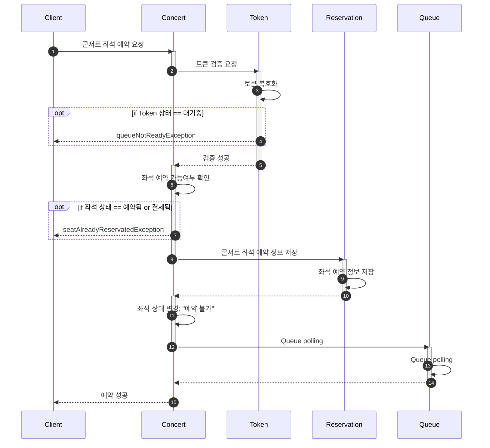
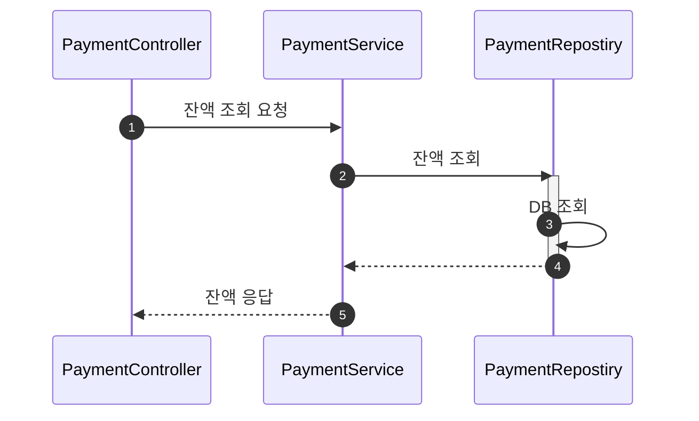
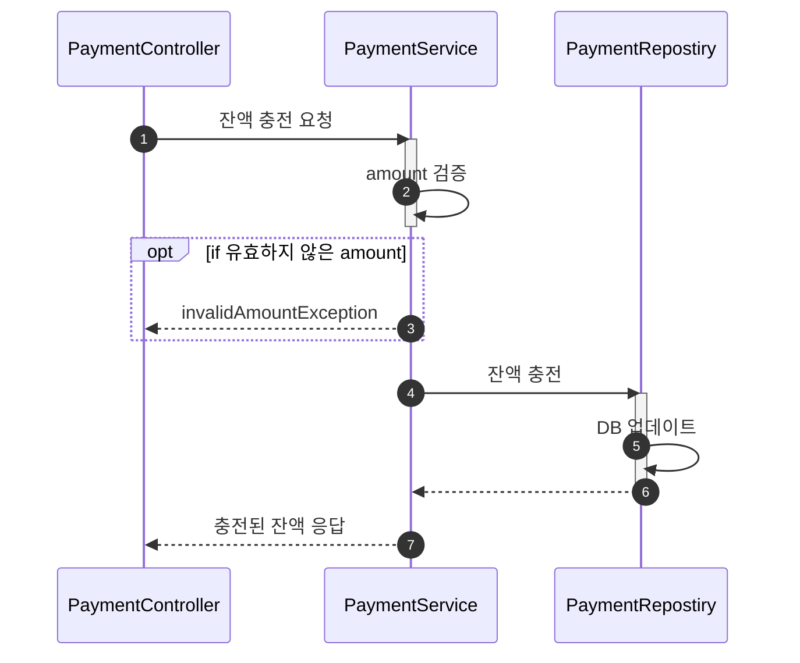
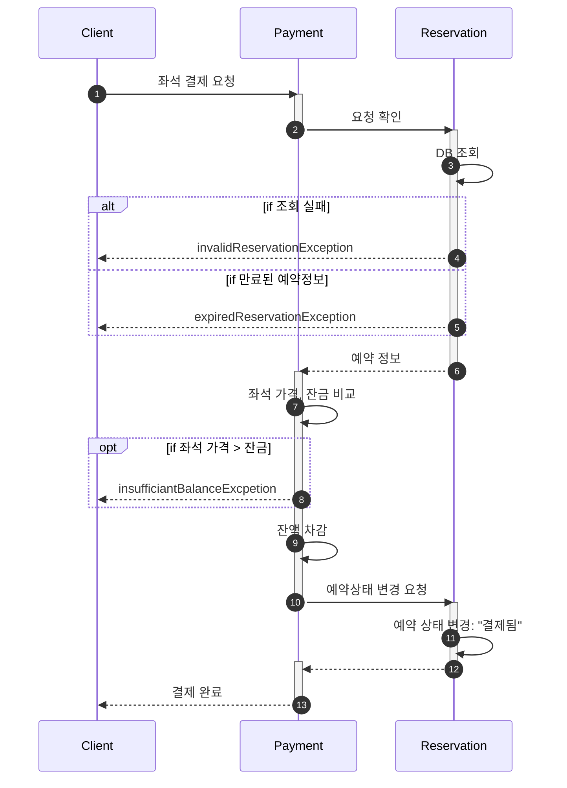
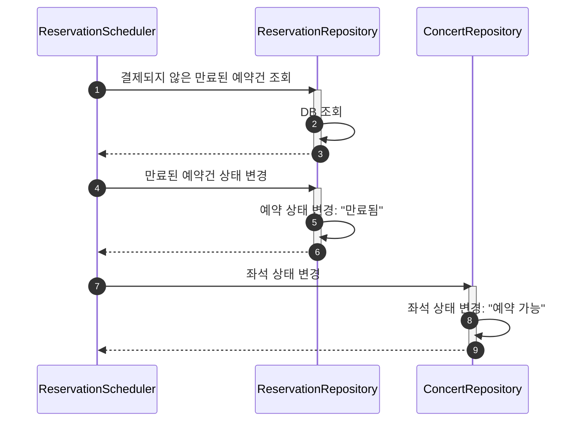

## 프로젝트
<details>

<summary>Getting Started</summary>

### Prerequisites

#### Running Docker Containers

`local` profile 로 실행하기 위하여 인프라가 설정되어 있는 Docker 컨테이너를 실행해주셔야 합니다.

```bash
docker-compose up -d
```
</details>

<details>
<summary>콘서트 예약 서비스</summary>

## Description

- **`콘서트 예약 서비스`**를 구현해 봅니다.
- 대기열 시스템을 구축하고, 예약 서비스는 작업가능한 유저만 수행할 수 있도록 해야합니다.
- 사용자는 좌석예약 시에 미리 충전한 잔액을 이용합니다.
- 좌석 예약 요청시에, 결제가 이루어지지 않더라도 일정 시간동안 다른 유저가 해당 좌석에 접근할 수 없도록 합니다.

## Requirements

- 아래 5가지 API 를 구현합니다.
    - 유저 토큰 발급 API
    - 예약 가능 날짜 / 좌석 API
    - 좌석 예약 요청 API
    - 잔액 충전 / 조회 API
    - 결제 API
- 각 기능 및 제약사항에 대해 단위 테스트를 반드시 하나 이상 작성하도록 합니다.
- 다수의 인스턴스로 어플리케이션이 동작하더라도 기능에 문제가 없도록 작성하도록 합니다.
- 동시성 이슈를 고려하여 구현합니다.
- 대기열 개념을 고려해 구현합니다.

## API Specs

1️⃣ **`주요` 유저 대기열 토큰 기능**

- 서비스를 이용할 토큰을 발급받는 API를 작성합니다.
- 토큰은 유저의 UUID 와 해당 유저의 대기열을 관리할 수 있는 정보 ( 대기 순서 or 잔여 시간 등 ) 를 포함합니다.
- 이후 모든 API 는 위 토큰을 이용해 대기열 검증을 통과해야 이용 가능합니다.

> 기본적으로 폴링으로 본인의 대기열을 확인한다고 가정하며, 다른 방안 또한 고려해보고 구현해 볼 수 있습니다.
*** 대기열 토큰 발급 API
* 대기번호 조회 API**
>

**2️⃣ `기본` 예약 가능 날짜 / 좌석 API**

- 예약가능한 날짜와 해당 날짜의 좌석을 조회하는 API 를 각각 작성합니다.
- 예약 가능한 날짜 목록을 조회할 수 있습니다.
- 날짜 정보를 입력받아 예약가능한 좌석정보를 조회할 수 있습니다.

> 좌석 정보는 1 ~ 50 까지의 좌석번호로 관리됩니다.
>

3️⃣ **`주요` 좌석 예약 요청 API**

- 날짜와 좌석 정보를 입력받아 좌석을 예약 처리하는 API 를 작성합니다.
- 좌석 예약과 동시에 해당 좌석은 그 유저에게 약 **5분**간 임시 배정됩니다. ( 시간은 정책에 따라 자율적으로 정의합니다. )
- 만약 배정 시간 내에 결제가 완료되지 않는다면 좌석에 대한 임시 배정은 해제되어야 한다.
- 누군가에게 점유된 동안에는 해당 좌석은 다른 사용자가 예약할 수 없어야 한다.

4️⃣ **`기본`**  **잔액 충전 / 조회 API**

- 결제에 사용될 금액을 API 를 통해 충전하는 API 를 작성합니다.
- 사용자 식별자 및 충전할 금액을 받아 잔액을 충전합니다.
- 사용자 식별자를 통해 해당 사용자의 잔액을 조회합니다.

5️⃣ **`주요` 결제 API**

- 결제 처리하고 결제 내역을 생성하는 API 를 작성합니다.
- 결제가 완료되면 해당 좌석의 소유권을 유저에게 배정하고 대기열 토큰을 만료시킵니다.

<aside>
💡 **KEY POINT**

</aside>

- 유저간 대기열을 요청 순서대로 정확하게 제공할 방법을 고민해 봅니다.
- 동시에 여러 사용자가 예약 요청을 했을 때, 좌석이 중복으로 배정 가능하지 않도록 합니다.
</details>

---

### Step03 ~ Step04
<details>
<summary>시퀀스 다이어그램</summary>

<details>
<summary><b>📌콘서트 조회 시퀀스 다이어그램</b></summary>
	

</details>

<details>
<summary><b>📌대기열 토큰 요청 시퀀스 다이어그램</b></summary>


</details>

<details>
<summary><b>📌대기열 확인 시퀀스 다이어그램</b></summary>


</details>

<details>
<summary><b>📌콘서트 날짜, 좌석 조회 시퀀스 다이어그램</b></summary>


</details>

<details>
<summary><b>📌콘서트 좌석 예약 시퀀스 다이어그램</b></summary>


</details>

<details>
<summary><b>📌잔액 조회 시퀀스 다이어그램</b></summary>


</details>

<details>
<summary><b>📌잔액 충전 시퀀스 다이어그램</b></summary>


</details>

<details>
<summary><b>📌좌석 결제 시퀀스 다이어그램</b></summary>


</details>

<details>
<summary><b>📌예약상태 스케줄러 시퀀스 다이어그램</b></summary>


</details>
</details>
<details>
<summary><b>ERD</b></summary>
	


</details>

---

### Step05
<details>
<summary>과제 내용</summary>

-  각 시나리오별 하기 **비즈니스 로직** 개발 및 **단위 테스트** 작성
    - `e-commerce` : 상품 조회, 주문/결제 기능, 포인트 충전 기능
    - `concert` : 콘서트 조회, 예약/결제 기능, 포인트 충전 기능

> **단위 테스트** 는 반드시 대상 객체/기능 에 대한 의존성만 존재해야 함
>
</details>

